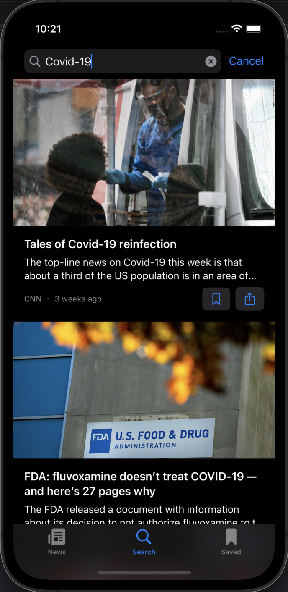

# iNews
<!-- ABOUT THE PROJECT -->
<p align="center">
  <a href="#" target="_blank"></a>
</p>

iNews adalah aplikasi iOS berita internasional yang datanya didapatkan dari [News API](https://newsapi.org/). Dibuat menggunakan SwiftUI, MVVM Design Pattern, dan Paw. Aplikasi ini memiliki fitur Search, Filter, Bookmark, Search History, Safari Browser, dan Sharing URL Berita.

## Preview
<p align="center">
    <a href="#" target="_blank"></a>
    <a href="#" target="_blank"></a>
    <a href="#" target="_blank"></a>
</p>
    
<!-- ABOUT THE FILE & FOLDER STRUCTURE -->
## Folder & File Structure
iNews mengikuti pedoman design pattern dengan 3 komponen, yaitu Model, View, & ViewModel (MVVM). 
Berikut struktur file dan folder pada iNews:

    .
    ├── iNewsApp.swift
    ├── ContentView.swift
    ├── news.json            
    ├── info
    ├── API                        # API: API Service (Fetch Data)
    │   └── NewsAPI.swift          # Berisikan Fungsi Decode JSON File, Fetch (data & response) via URL Session, & Generate Berita (search & kategori)
    │
    ├── Models                     # Models: API Data Declaration
    │   ├── Article.swift          # Berisikan Endpoints Data yang digunakan dari API
    │   ├── Category.swift         # Berisikan Kategori berita (Raw Data)
    │   ├── DataStore.swift        # Berisikan Concurrency Type untuk membantu menghindari masalah ketika terjadi update pada value
    │   └── NewsAPIResponse.swift  # Berisikan API Response Code (Handler)
    │
    ├── ViewModel                           # ViewModel: Information Handler & CRUD Logic
    │   ├── ArticleBookmarkViewModel.swift  # Berisikan Fungsi CRUD untuk Fitur Bookmark
    │   ├── ArticleNewsViewModel.swift      # Berisikan Fungsi Load Berita dari API
    │   └── ArticleSearchViewModel.swift    # Berisikan Fungsi CRUD untuk Fitur Search dan Search History
    │
    └── Views                           # Views: Controller UI & Frontend Related (Show & Get)
        ├── ArticleListView.swift       # Berisikan Tampilan Berita dalam Bentuk List
        ├── ArticleRowView.swift        # Berisikan Tampilan Berita (Card)
        ├── BookmarkTabView.swift       # Berisikan Tampilan Halaman Bookmark
        ├── EmptyPlaceholderView.swift  # Berisikan Skeleton Card Berita (ketika loading / fetching data)
        ├── NewsTabView.swift           # Berisikan Tampilan Halaman Beranda Aplikasi
        ├── RetryView.swift             # Berisikan Tampilan Retry
        ├── SafariView.swift            # Berisikan Fungsi untuk Membuka Browser Safari dari URL Berita
        ├── SearchHistoryListView.swift # Berisikan Komponen dari List Riwayat Pencarian
        └── SearchTabView.swift         # Berisikan Tampilan Halaman Search

<!-- List of Features -->
## Features:

* CRUD -> Kategori Berita, Bookmark, & Search History
* MVVM Design Pattern
* Search
* Filter Kategori
* Bookmark
* Sharing Berita URL
* Safari Browser

<!-- Used Tools -->
## Build With:

* [Swift](https://www.swift.org/documentation/)
* [SwiftUI](https://developer.apple.com/xcode/swiftui/)
* [Xcode](https://developer.apple.com/xcode/)
* [News API](https://newsapi.org/)
* [Paw](https://paw.cloud/)
* [VSCode](https://code.visualstudio.com/)

<!-- How to Install -->
## Installation
Untuk menggunakan repositori ini, ikutilah petunjuk penggunaan berikut dan pastikan git sudah terinstall pada komputer (semua perintah dilaksanakan pada `cmd.exe` atau `terminal`):

1. Lakukan download .zip atau `clone` repositori dengan cara:
```bash
git clone https://github.com/dekapd99/iNews.git
```

2. Buka project di Xcode dan copy API Key dari [newsapi.org](https://newsapi.org/).
3. Jika sudah, buka Project Navigation klik API > NewsAPI.swift, paste string pada variabel apiKey dengan API Key Anda.
4. Build & Run

<!-- What Kind of License? -->
## License
No License 

<p align="right">(<a href="#top">back to top</a>)</p>
